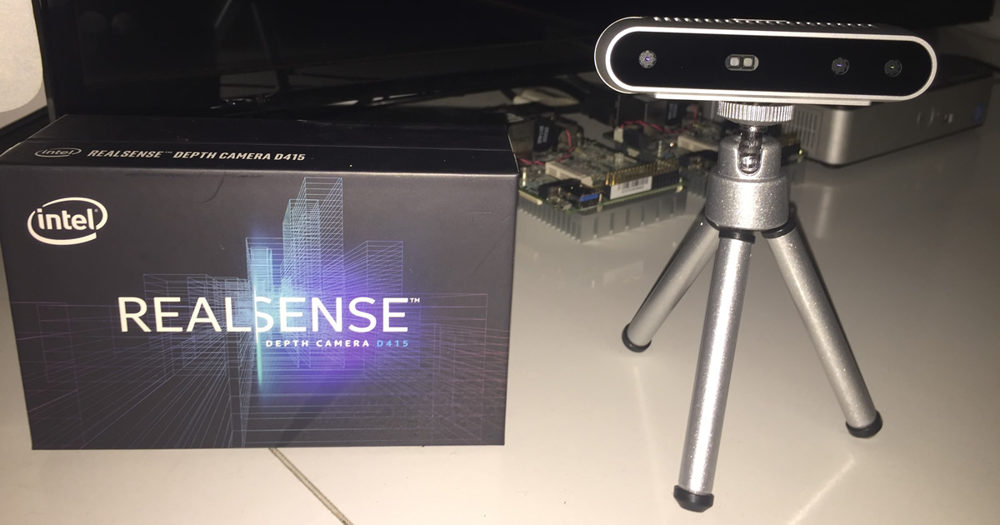

# GeniSysAI RealSense TASS Device
[](https://github.com/GeniSysAI/Vision/tree/master/RealSense)

[](https://github.com/GeniSysAI/NLU/tree/0.0.1)

# About GeniSysAI 

GeniSysAI is a project I created for my home and decided to open source a version for others to learn or use at home. The project is a home Artificial Intelligence Assistant Network that uses Computer Vision, Natural Linguistics and the Internet of Things working together to create a single "intelligence". GeniSysAI uses a system based on [TASS A.I](https://github.com/TASS-AI/TASS-Facenet "TASS A.I") for [vision](https://github.com/GeniSysAI/Vision "vision"), an [NLU engine](https://github.com/GeniSysAI/NLU "NLU engine") for natural language understanding, in browser speech synthesis and speech recognition for speech and hearing, and a home [server](https://github.com/GeniSysAI/Server "server") managed via a secure GUI.

# About GeniSysAI TASS Devices

As mentioned above, GeniSysAI TASS Devices are based on tassAI, a computer vision software I made that is able to communicate with applications and devices via the Internet of Things. There are several versions of TASS and several different projects that evolved from the concept. Each version of TASS uses different techniques and technologies to accomplish facial recognition and other computer vision uses. For a full history of tassAI, check out the [tassAI history repo](https://github.com/TASS-AI/Tass-History "tassAI history repo").

**GeniSysAI TASS Devices** currently use Siamese Neural Networks and Triplet Loss ([davidsandberg/facenet Github](https://github.com/davidsandberg/facenet "davidsandberg/facenet")) to classify known and unknown faces. Basically we use the Siamese Neural Networks to calculate the distance between a presented image and a folder of images of known faces.  

There are currently three different types of TASS devices used for the GeniSysAI TASS devices.

- [Local](https://github.com/GeniSysAI/Vision/tree/master/Local "Local")
- [Foscam](https://github.com/GeniSysAI/Vision/tree/master/Foscam "Foscam")
- [RealSense](https://github.com/GeniSysAI/Vision/tree/master/RealSense "RealSense")

# About GeniSysAI RealSense TASS Device

The main GeniSysAI RealSense TASS Device program runs in the background and connects to the RealSense camera stream and also to the iotJumpWay, it processes each frame alerting the iotJumpWay of the classification (Only that there was a positive or negative classification). Each time a known person is identified, the location in their user account is updated based on the configuration of the TASS device, and then updates frame and streams the modified frame to a stream allowing other devices and applications to connect to the feed. You are able to set rules on the iotJumpWay allowing autonomous communication with other IoT devices and applications in the event of identifications or intruders.

When using the GeniSysAI RealSense TASS Device as it is designed to be used, you will be able to ask your AI who you are and they will be able to identify you, in the background logic helps keep track of where known users or intruders are etc.

## Prerequisites 

You must of already completed the setup of the following project(s):

- [GeniSysAI Server](https://github.com/GeniSysAI/Server "GeniSysAI Server")

## Python Versions

- Tested in Python 3

## Software Requirements

- [Intel® NCSDK](https://github.com/movidius/ncsdk "Intel® NCSDK")
- [LibRealSense](https://github.com/IntelRealSense/librealsense "LibRealSense")
- [Tensorflow 1.4.0](https://www.tensorflow.org/install "Tensorflow 1.4.0")
- [iotJumpWay MQTT Client](https://github.com/iotJumpway/JumpWayMQTT "iotJumpWay MQTT Client")

## Hardware Requirements

- 1 x [Intel® Movidius](https://www.movidius.com/ "Intel® Movidius")
- 1 x [Intel® RealSense™ Depth Camera D415](https://click.intel.com/intelr-realsensetm-depth-camera-d415.html "Intel® RealSense™ Depth Camera D415")
- 1 x [Intel®/Aaeon UP Squared Grove Developer Kit](https://software.intel.com/en-us/iot/hardware/up-squared-grove-dev-kit "Intel®/Aaeon UP Squared Grove Developer Kit")

# What Will We Do?

1. Configure the UFW firewall on the UP Squared/Raspberry Pi/Linux device to allow traffic to the ports used in this project.
2. Update the Linux distribution on the UP Squared/Raspberry Pi/Linux device.

# Setup Your UP2/RPI/Linux Device

First you should setup your UP Squared/Raspberry Pi/Linux device ready for the rest of the tutorial. This tutorial is designed to be used on UP Squared, but you can use whatever you like as the device as long as it is running Ubuntu 16.04 or above. It may function with other OS but has not been tested. To setup your device, follow the guide below.

## Configure Device UFW Firewall

UFW firewall is used to protect the ports of your TASS device. 

```
 $ sudo ufw status
   Status: inactive
```

All you need to do is open the ports (described below) that you decide to use for this project. The ports are specified in **required/confs.json**. The default settings are set to **8080** for the streaming port and **8181** for the socket port. **FOR YOUR SECURITY YOU SHOULD CHANGE THESE!**.

```
"Cameras": [
    {
        "ID": 0,
        "URL": "",
        "RTSPuser": "",
        "RTSPpass": "",
        "RTSPip": "",
        "RTSPport": 0,
        "RTSPendpoint": "",
        "Name": "",
        "Stream": "",
        "StreamAccess": "",
        "StreamPort": 8080,
        "SocketPort": 8181 
    }
]
```

To allow access to the ports use the following command for each of your ports using your terminal:

```
 $ sudo ufw allow YourPortNumber
```

## Update Linux Distribution

First update your distribution to make sure everything is up to date and you have the latest security patches, this may take some time. 

```
 $ sudo apt-get update && sudo apt-get upgrade && sudo apt-get dist-upgrade
```

# Tracking & Privacy

It is important to note that TASS communicates with the iotJumpWay to register events that can be used in conjunction with rules set up in the iotJumpWay console. No identifying information is now sent to the iotJumpWay, instead all data is stored on the local server MySql database. This ensures you remain in control of the data generated on your network, but can also benefit from automation via iotJumpWay rules.

# Contributing

Please read [CONTRIBUTING.md](https://github.com/GeniSysAI/Vision/blob/master/CONTRIBUTING.md "CONTRIBUTING.md") for details on my code of conduct, and the process for submitting pull requests to me.

# Versioning

I use SemVer for versioning. For the versions available, see [GeniSysAI/Vision/releases](https://github.com/GeniSysAI/Vision/releases "GeniSysAI/Vision/releases").

# License

This project is licensed under the **MIT License** - see the [LICENSE](https://github.com/GeniSysAI/Vision/blob/master/LICENSE "LICENSE") file for details.

# Bugs/Issues

I use the [repo issues](https://github.com/GeniSysAI/Vision/issues "repo issues") to track bugs and general requests related to using this project. 

# Acknowledgements

- Uses code from Intel® **movidius/ncsdk** ([movidius/ncsdk Github](https://github.com/movidius/ncsdk "movidius/ncsdk Github"))
- Uses code from Intel® **davidsandberg/facenet** ([davidsandberg/facenet Github](https://github.com/davidsandberg/facenet "davidsandberg/facenet"))

# Useful Links

Links to related articles that helped at various stages of the project for research / code examples:

- [Open Set Recognition Issue](https://www.wjscheirer.com/projects/openset-recognition/ "Open Set Recognition Issue")
- [Lossless Triplet loss, A more efficient loss function for Siamese NN](https://towardsdatascience.com/lossless-triplet-loss-7e932f990b24 "Lossless Triplet loss, A more efficient loss function for Siamese NN")
- [PyImageSearch](https://www.pyimagesearch.com/ "PyImageSearch")

# Author

I am a [BigFinite](https://www.bigfinite.com "BigFinite") IoT Network Engneer, part of the team that works on the core IoT software for our platform. In my spare time I am an [Intel Software Innovator](https://software.intel.com/en-us/intel-software-innovators/overview "Intel Software Innovator") in the fields of Internet of Things, Artificial Intelligence and Virtual Reality.

[](https://github.com/AdamMiltonBarker)


